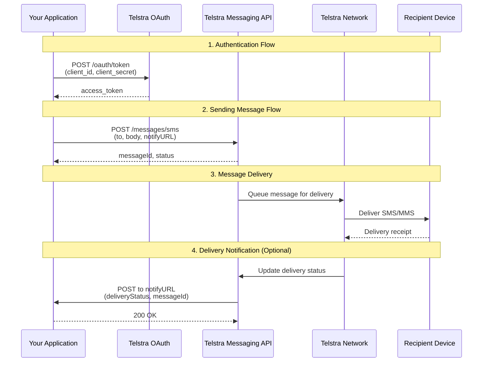
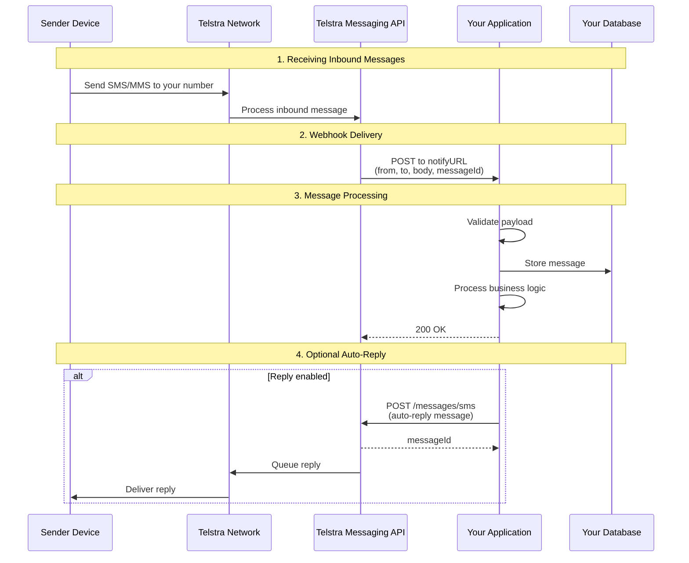
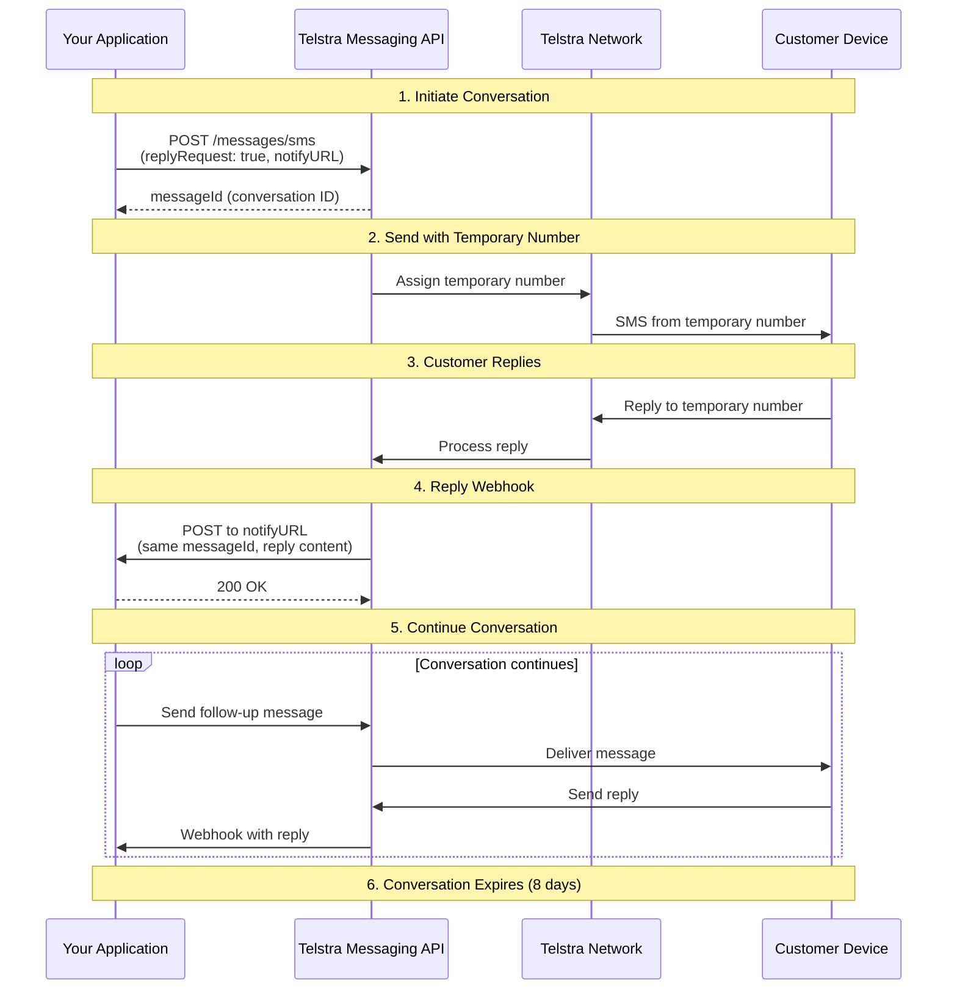
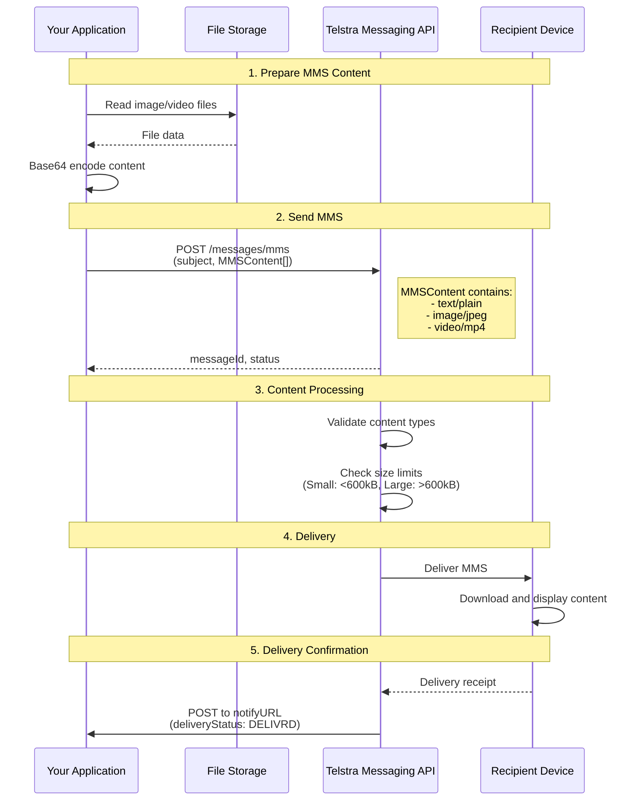
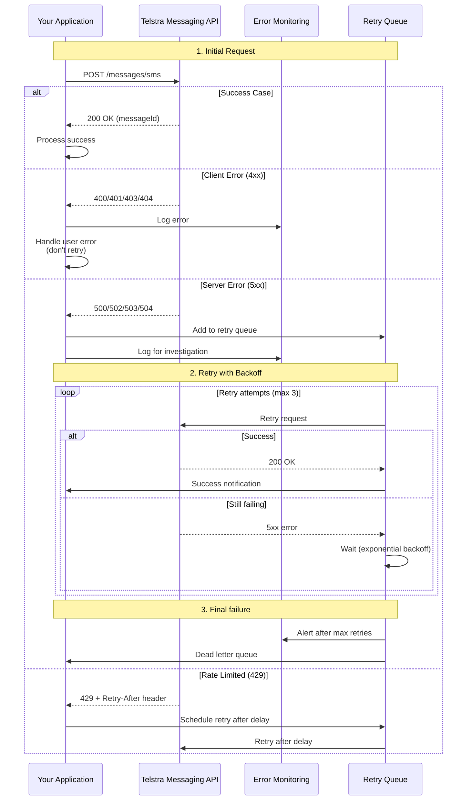
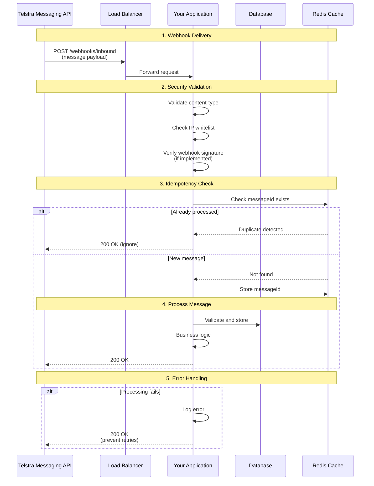
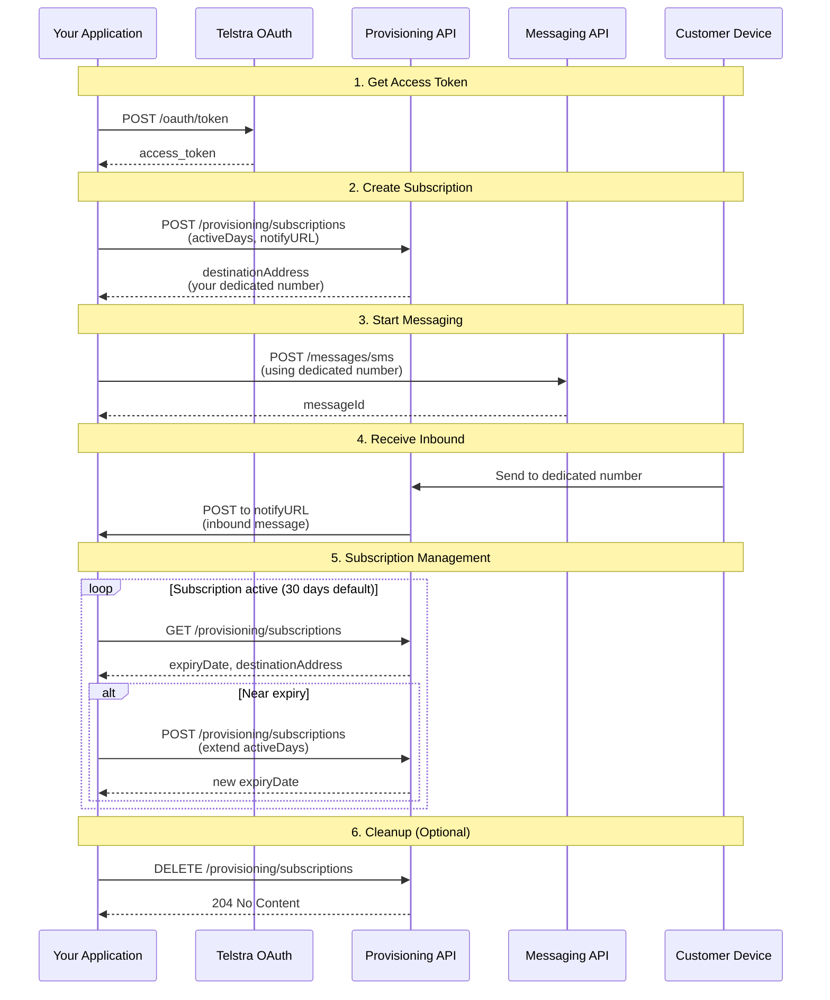
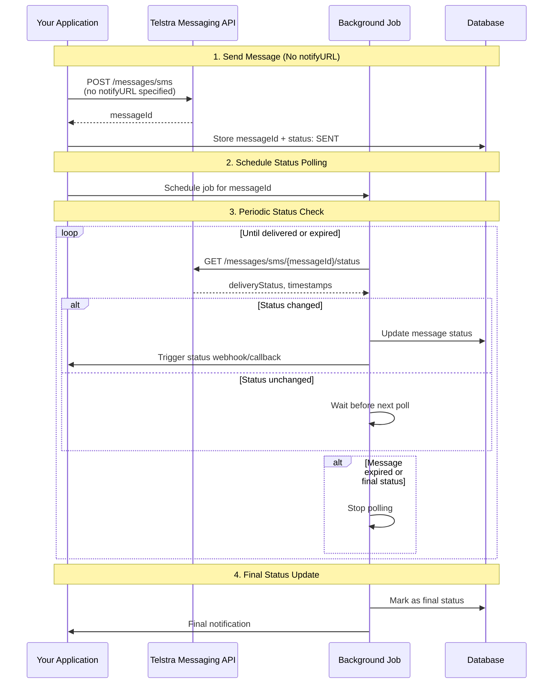

# Message Flow Sequence Diagram

This document provides visual representations of the message flows in the Telstra Messaging API.

## Outbound Message Flow (Sending Messages)

## Inbound Message Flow (Receiving Messages)

## Reply Request Flow (Two-Way Messaging)

## MMS with Multiple Content Flow

## Error Handling Flow

## Webhook Security Flow

## Provisioning Flow

## Message Status Polling Flow

These diagrams illustrate the key workflows when using the Telstra Messaging API Ruby SDK. They can help developers understand the interaction patterns and implement robust messaging solutions.